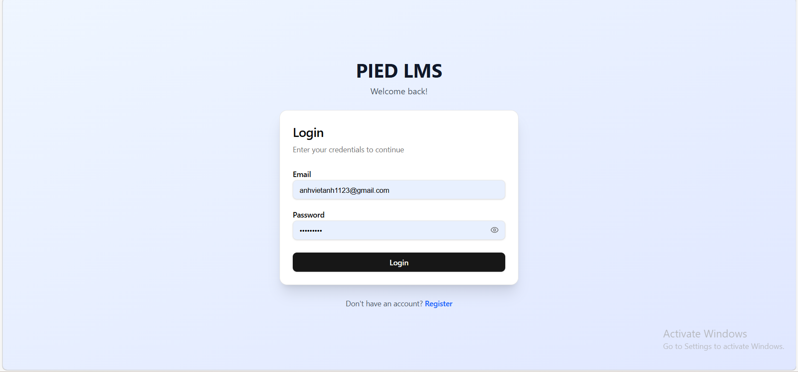
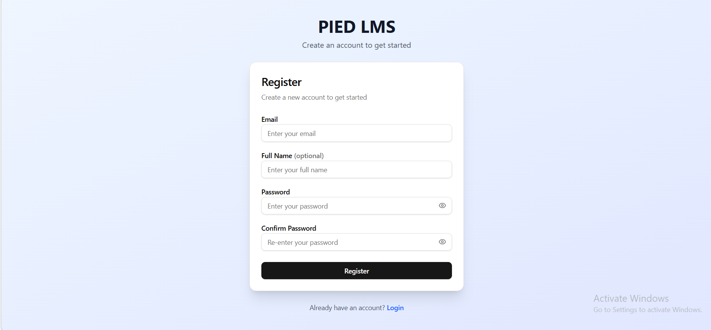
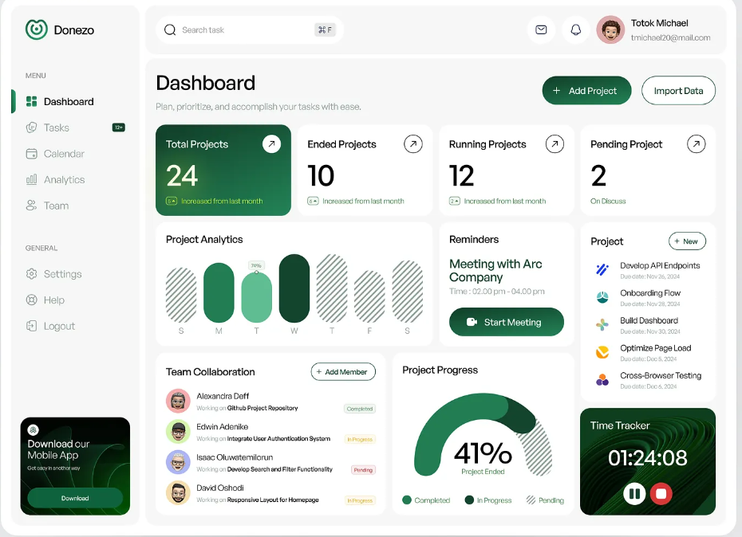

# Trang web sẽ có những gì?
## Chức năng
    1. Input đầu vào báo cáo tài chính 
    2. Search báo cáo tài chính đang có
    3. Core feature:
        3.1 Phân tích Báo cáo tài chính
        3.2 Phân tích giang lận
        3.3 Cashflow
        3.4 Dự phóng: 
            3.4.1 Dự phóng dựa vào context có sẵn theo dữ liệu được lấy từ data quá khứ
            3.4.2 Dự phóng dựa vào context mà người dùng đưa cho (edit)
    4. Login (Email-password-resetpassword)

## UI cơ bản dùng shadcn
    1. Auth
        Làm trang Login, Register, Resetpassword

    2. Trang chủ
        2.1 Header sẽ có: Logo, Cài đặt(Icon bánh răng), 1 thanh menu nhỏ cho việc tuỳ chỉnh profile người dùng(Avata người dùng)
        2.2 Body: 
            2.2.1 Phía đầu sẽ có 1 thanh tìm kiếm ở giữa và placeholder là tìm kiếm tài liệu đã có
            2.2.2 Ở phía bên trái sẽ có thanh sidebar chứa các dồng thông tin bao gồm: Khởi tạo dự án, dự án nổi bật, setting logout
       
